# Athlete Pension Platform - Architecture Diagrams

## System Overview

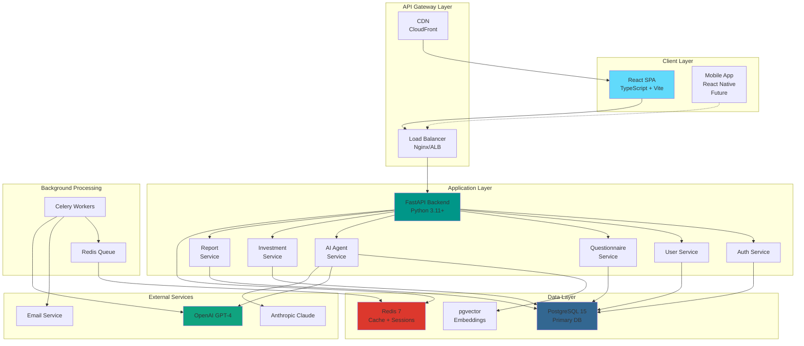

## Data Flow - User Onboarding

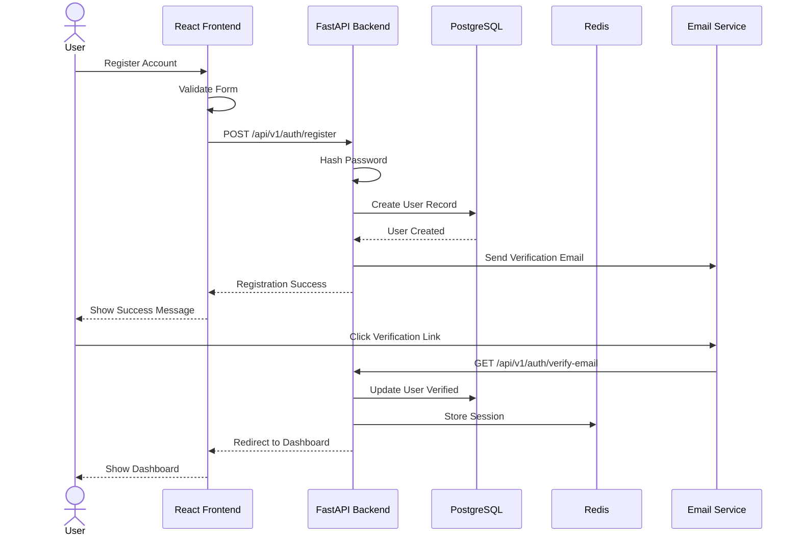

## Data Flow - AI Investment Recommendation

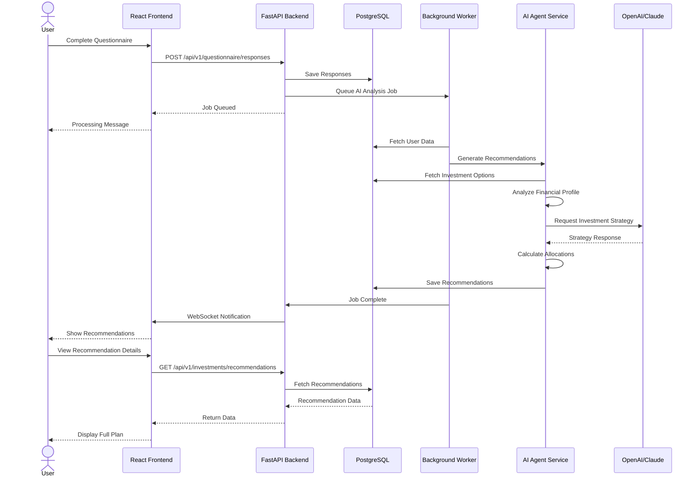

## AI Agent Architecture

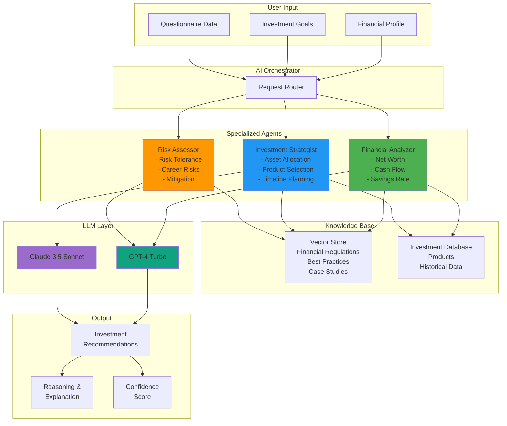

## Database Schema Relationships

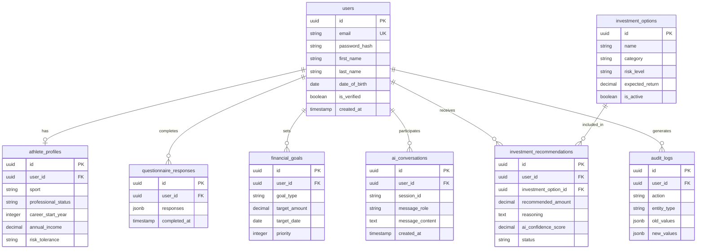

## Authentication Flow

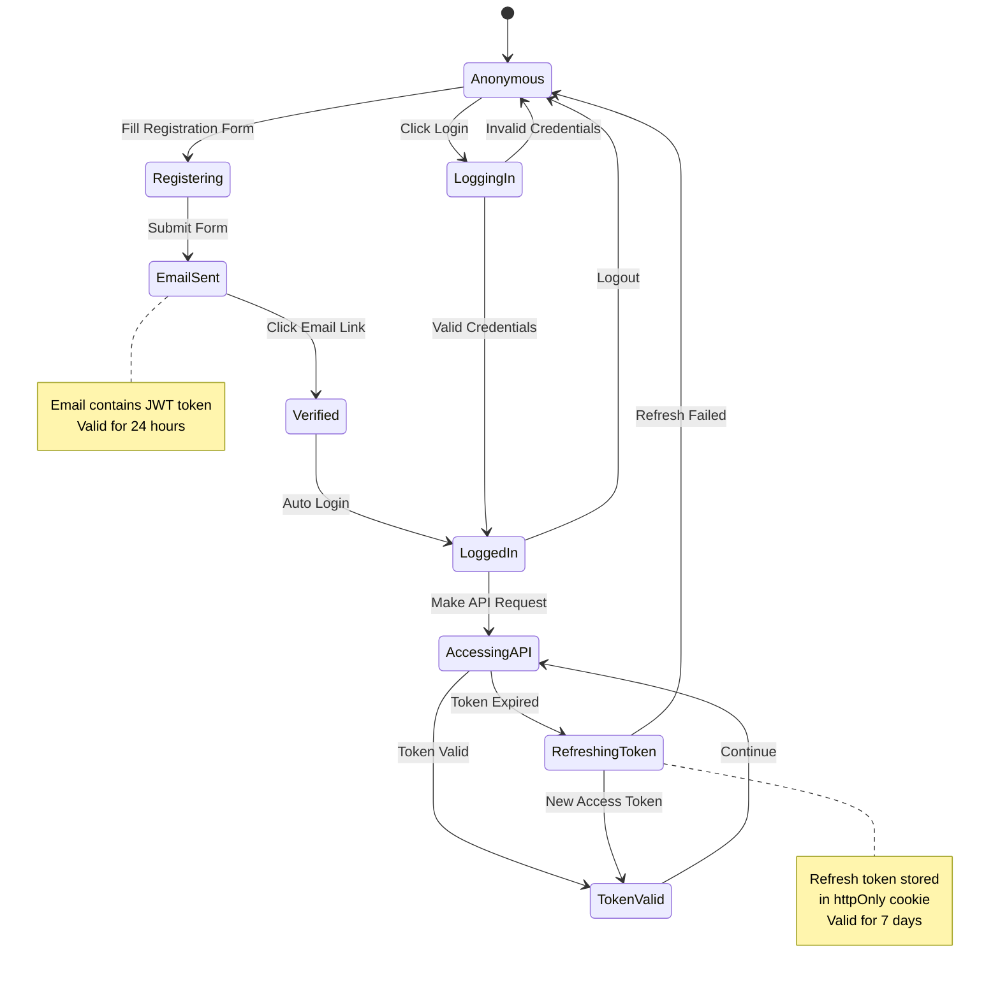

## Deployment Pipeline

```mermaid
graph LR
    subgraph Development
        Dev["Developer<br/>Local Machine"]
        Git["Git Commit<br/>& Push"]
    end

    subgraph CI["Continuous Integration"]
        GH["GitHub Actions<br/>Triggered"]
        Test["Run Tests<br/>pytest + vitest"]
        Lint["Code Quality<br/>black + eslint"]
        Build["Build Images<br/>Docker"]
    end

    subgraph Registry
        ECR["AWS ECR<br/>Image Registry"]
    end

    subgraph CD["Continuous Deployment"]
        Deploy["Deploy to ECS"]
        Migrate["Run Migrations"]
        Health["Health Check"]
    end

    subgraph Production
        ECS["ECS Fargate<br/>Containers"]
        RDS["RDS PostgreSQL"]
        S3["S3 + CloudFront<br/>Frontend"]
    end

    Dev --> Git
    Git --> GH
    GH --> Test
    Test --> Lint
    Lint --> Build
    Build --> ECR
    ECR --> Deploy
    Deploy --> Migrate
    Migrate --> Health
    Health --> ECS
    Health --> S3
    ECS --> RDS
    
    style Test fill:#4caf50
    style Lint fill:#2196f3
    style Build fill:#ff9800
    style ECS fill:#ff5722
```

## Frontend Component Hierarchy

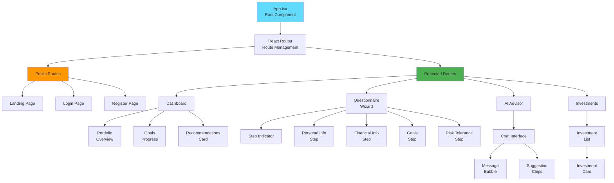

## Security Architecture

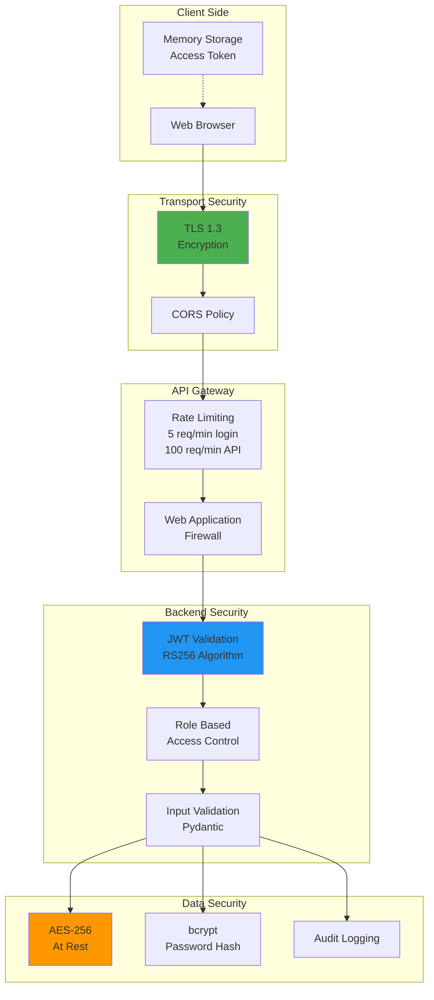

## Monitoring & Observability Stack

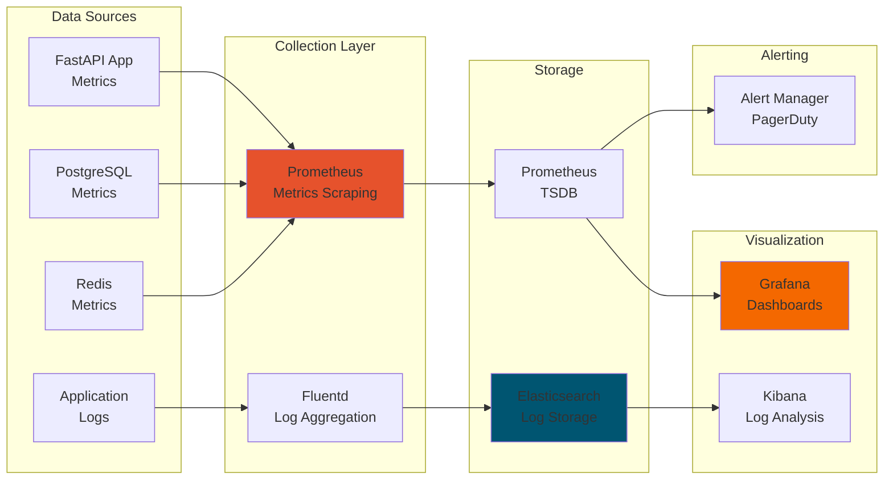

## Cost Estimation (AWS)

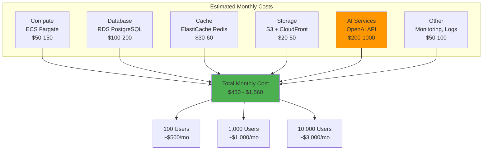

---

## Summary

These diagrams provide a visual representation of the Athlete Pension platform architecture:

1. **System Overview**: High-level component interactions
2. **Data Flows**: Sequence diagrams for key user journeys
3. **AI Agent Architecture**: Multi-agent system design
4. **Database Schema**: Entity relationships
5. **Authentication Flow**: State transitions
6. **Deployment Pipeline**: CI/CD process
7. **Frontend Hierarchy**: Component structure
8. **Security Architecture**: Security layers
9. **Monitoring Stack**: Observability setup
10. **Cost Estimation**: AWS infrastructure costs

Use these diagrams alongside [`ARCHITECTURE.md`](ARCHITECTURE.md:1) for complete architectural understanding.